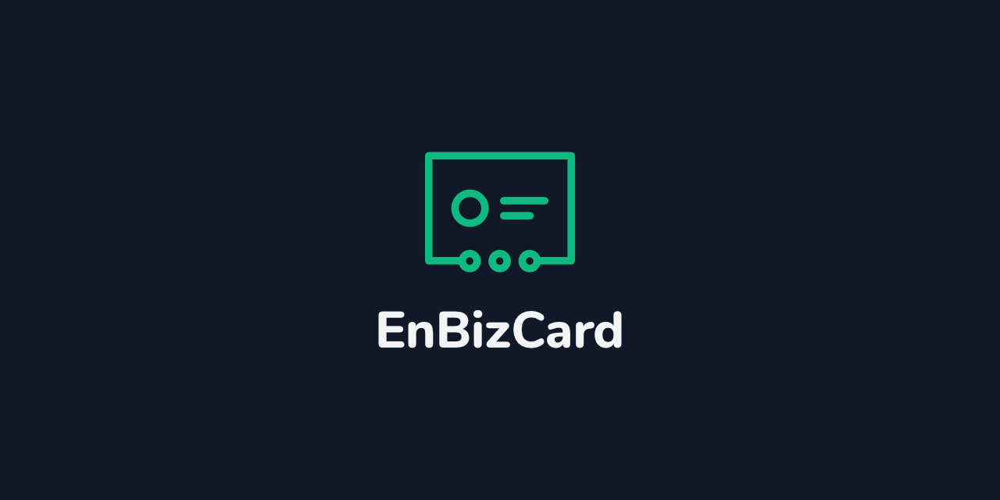

<p align="center"><a href="https://enbizcard.vercel.app/"></a></p>

<h1 align="center">An Open-Source Digital Business Card Generator</h1>
<!-- <h3 align="center">Your Website Can Host Your Digital Business Cards for FREE!</h3> -->
<h3 align="center">Why Pay When Your Digital Business Cards Can Be Hosted on Your Website for Free!</h3>
<p align="center">EnBizCard helps you create interactive and responsive HTML-based digital business cards that can be hosted with your website.</p>
<h3 align="center"><a href="https://enbizcard.vercel.app">Open App</a> | <a href="https://enbizcard.vercel.app">View demo</a></h3>

---

<p align="center">
<a href="https://www.gnu.org/licenses/agpl-3.0" alt="License: GPLv3"></a> <a href="https://github.com/vishnuraghavb/EnBizCard/issues" alt="GitHub issues"></a> <a href="https://liberapay.com/vishnuraghavb/donate" alt="Liberapay"></a> <a href="https://www.vishnuraghav.com/donate" alt="Donate"></a></p>

---

## Goals

- Minimize the cost of paying third-party services to host your digital business cards
- Elegant design and functionality
- Quick and easy setup

## Features

- Concise action buttons
- Click to contact via Phone, WhatsApp, Email, etc
- Direct vCard download (lets user download your contact information to their phone)
- Social media links
- PGP public key sharing with fingerprint
- Share your card with anyone using QR-code or link
- Showcase images, artworks, music, videos, poems, brochures, products, services or anything up to your imagination
- Embed any kind of HTML content (videos, music, maps, contact forms, you name it.)
- Track your audience with analytics
- Custom fonts

## Highlights

- Zero limitations
- Your data belongs to you
- Private by design

## Future

Check out the [roadmap](https://github.com/vishnuraghavb/EnBizCard/projects/1) to see the upcoming features of Digital Business Card Generator.

Your feedback and suggestions are very important. If you have an idea to improve Digital Business Card Generator, [do let me know](#having-issues-suggestions-and-feedback). I'm always open to ideas ;)

## Having issues, suggestions and feedback?

You can,

- [Create an issue here](https://github.com/vishnuraghavb/EnBizCard/issues)
- [Join the Telegram group](http://t.me/enbizcard) (quicker replies and best for discussion)
- Contact me at apps@vishnuraghav.com

## Assets

- [Boxicons](https://boxicons.com/)
- [Feather icons](https://feathericons.com)
- Logo and some icons by [Vishnu Raghav](https://www.vishnuraghav.com/)
- [QRCode-SVG](https://github.com/papnkukn/qrcode-svg)

## License

```
EnBizCard - An Open-Source Digital Business Card Generator
Copyright (C) 2021  Vishnu Raghav B

This program is free software: you can redistribute it and/or modify
it under the terms of the GNU Affero General Public License as published
by the Free Software Foundation, either version 3 of the License, or
(at your option) any later version.

This program is distributed in the hope that it will be useful,
but WITHOUT ANY WARRANTY; without even the implied warranty of
MERCHANTABILITY or FITNESS FOR A PARTICULAR PURPOSE.  See the
GNU Affero General Public License for more details.

You should have received a copy of the GNU Affero General Public License
along with this program.  If not, see <https://www.gnu.org/licenses/>.
```

## Support me

<a href="https://www.vishnuraghav.com/donate/"></a>
